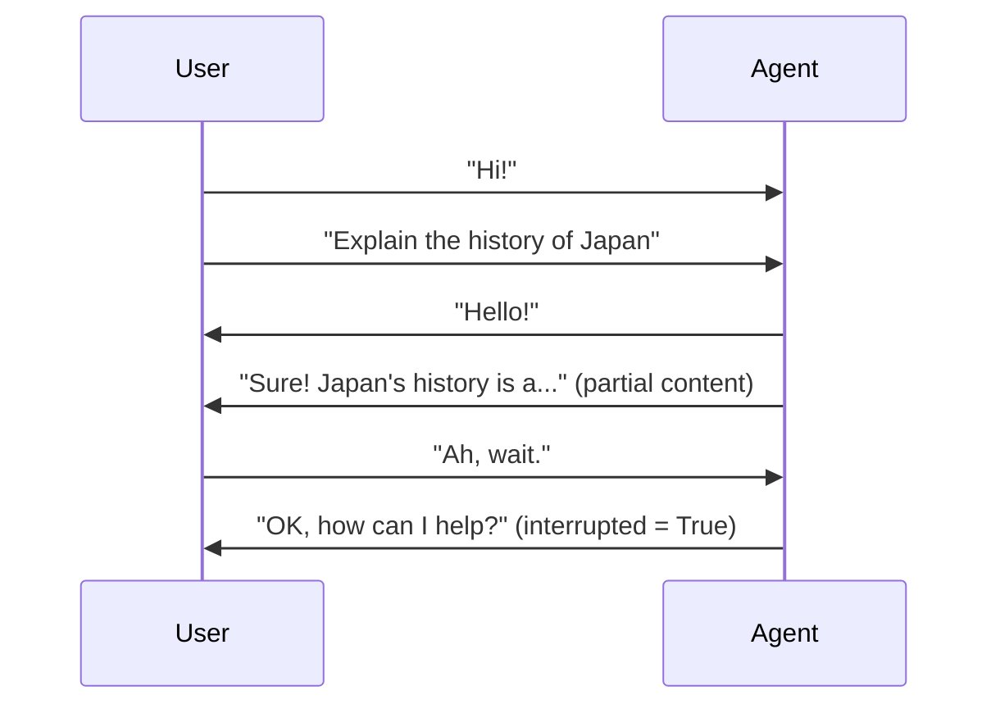
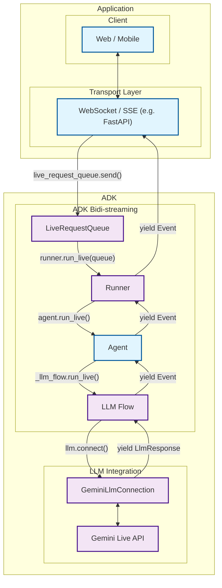

# ADK 雙向串流開發指南：第一部分 - 介紹

歡迎來到 [Agent Development Kit (ADK)](https://google.github.io/adk-docs/) 雙向串流（bidirectional streaming）的世界。本文將帶你從傳統的請求-回應（request-response）模式，轉變為動態、即時且自然如人類對話般的 AI agent 溝通方式。

想像一下，你正在打造一個 AI 助理，它不再只是等你說完才回應，而是能夠主動傾聽，甚至在你突然想到新問題時，隨時打斷它的回應。再想像一下，建立客服機器人時，能同時處理語音、影像與文字，並且在整個對話過程中維持上下文。這就是雙向串流的強大之處，而 ADK 讓每位開發者都能輕鬆實現這些功能。

## 1.1 什麼是雙向串流（Bidi-streaming）？ { #what-is-bidi-streaming }

雙向串流（Bidirectional streaming）代表著 AI 互動模式的根本性轉變。它打破了僵化的「提問-等待」流程，實現了**即時、雙向溝通**，讓人與 AI 能同時說話、傾聽並回應。這種方式創造出自然且具人性化的對話體驗，帶來即時反應與革命性的「可中斷」互動能力。

你可以想像成電子郵件與電話對話的差異。傳統的 AI 互動就像電子郵件——你發送一則完整訊息，等待完整回應，然後再發送下一則訊息。雙向串流則像電話對話——流暢、自然，能即時打斷、澄清與回應。

### 主要特點

以下這些特點，使雙向串流與傳統 AI 互動方式截然不同，並賦予其打造高度互動使用者體驗的獨特優勢：

- **雙向溝通**：資料可持續雙向傳遞，無需等待完整回應。無論是使用者還是 AI，都能在你還沒說完問題的前幾個字時就開始回應，讓對話體驗更像真正的交流，而非單純的交易。

- **即時中斷回應**：這或許是最貼近自然對話的關鍵特性——使用者可在 agent 回應途中隨時以新輸入打斷，就像人與人之間的交談。如果 AI 正在解釋量子物理，你突然問「等等，什麼是電子？」，AI 會立刻停止原本的說明，直接回應你的新問題。

- **多模態最佳化**：可同時支援文字、語音與影像輸入，創造豐富且自然的互動體驗。使用者可以邊說話邊展示文件，在語音通話中輸入追問，或在不同溝通模式間無縫切換，且不會失去上下文。



### 與其他串流類型的差異

了解雙向串流（bidirectional streaming）與其他方法的不同，有助於認識其獨特價值。串流技術的應用場景包含數種明確的模式，各自適用於不同的使用情境：

!!! info "串流類型比較"

    **Bidi-streaming** differs fundamentally from other streaming approaches:

    - **Server-Side Streaming**: One-way data flow from server to client. Like watching a live video stream—you receive continuous data but can't interact with it in real-time. Useful for dashboards or live feeds, but not for conversations.

    - **Token-Level Streaming**: Sequential text token delivery without interruption. The AI generates response word-by-word, but you must wait for completion before sending new input. Like watching someone type a message in real-time—you see it forming, but can't interrupt.

    - **Bidirectional Streaming**: Full two-way communication with interruption support. True conversational AI where both parties can speak, listen, and respond simultaneously. This is what enables natural dialogue where you can interrupt, clarify, or change topics mid-conversation.

### 真實世界應用

雙向串流（Bidirectional streaming）徹底革新了 agentic AI 應用，讓 agent 能以類似人類的即時反應與智慧進行互動。這些應用展示了串流如何將靜態的 AI 互動轉變為動態、由 agent 主導的體驗，讓人感受到真正的智慧與主動性。

在 [Shopper's Concierge demo](https://www.youtube.com/watch?v=LwHPYyw7u6U) 的影片中，多模態、雙向串流功能大幅提升了電子商務的使用者體驗，使購物過程更快速、更直覺。結合對話理解與快速、平行化搜尋，實現了如虛擬試穿等進階功能，提升買家信心並降低線上購物的摩擦。

<div class="video-grid">
  <div class="video-item">
    <div class="video-container">
      <iframe src="https://www.youtube-nocookie.com/embed/LwHPYyw7u6U?si=xxIEhnKBapzQA6VV" title="Shopper's Concierge" frameborder="0" allow="accelerometer; autoplay; clipboard-write; encrypted-media; gyroscope; picture-in-picture; web-share" referrerpolicy="strict-origin-when-cross-origin" allowfullscreen></iframe>
    </div>
  </div>
</div>

此外，你可以想像許多雙向串流在真實世界中的應用場景：

1. **客戶服務與聯絡中心**：這是最直接的應用。該技術可打造遠超傳統聊天機器人的進階虛擬 agent。

    - **應用案例**：顧客致電零售公司的客服專線，反映產品有瑕疵。
    - **多模態（影像）**：顧客可以說：「我的咖啡機底部在漏水，我給你看一下。」然後用手機鏡頭即時串流問題畫面。AI agent 可利用視覺能力辨識機型及故障點。
    - **即時互動與打斷**：當 agent 說：「好的，我正在為您的 Model X 咖啡機辦理退貨。」顧客可以立刻打斷說：「等等，不是，是 Model Y Pro。」agent 能立即修正，不需重啟對話。

1. **現場服務與技術支援**：現場技術人員可利用免持、語音啟動的助手獲得即時協助。

    - **應用案例**：一位 HVAC 技術人員在現場診斷複雜的商用空調設備。
    - **多模態（影像與語音）**：技術人員戴著智慧眼鏡或用手機，將第一人稱視角串流給 AI agent，並詢問：「這個壓縮機有怪聲，你能幫我辨識並調出這個型號的診斷流程圖嗎？」
    - **即時互動**：agent 可逐步引導技術人員，技術人員也能隨時發問或打斷，無需放下工具。

1. **醫療保健與遠距醫療**：agent 可作為病患初步接觸、分診與基礎諮詢的第一線。

    - **應用案例**：病患透過醫療服務提供者的 app 進行皮膚狀況初步諮詢。
    - **多模態（影像／照片）**：病患可安全地分享皮疹的即時影像或高解析度照片，AI 可進行初步分析並提出釐清問題。

1. **金融服務與財富管理**：agent 可為客戶提供安全、互動性高且資料豐富的財務管理方式。

    - **應用案例**：客戶希望檢視投資組合並討論市場趨勢。
    - **多模態（螢幕共享）**：agent 可共享螢幕，展示圖表、投資組合績效等資料。客戶也可共享螢幕，指向特定新聞並詢問：「這個事件對我的科技股有什麼潛在影響？」
    - **即時互動**：agent 可存取客戶帳戶資料，分析現有投組配置，並模擬潛在交易對風險狀況的影響。

## 1.2 ADK 雙向串流架構總覽 { #adk-bidi-streaming-architecture-overview }

Agent Development Kit (ADK) 雙向串流架構讓 AI 雙向對話如同人類對話般自然。此架構透過精心設計的高效管線，無縫整合 Google 的 [Gemini Live API](https://ai.google.dev/gemini-api/docs/live)，實現低延遲與高吞吐量的通訊。

系統可處理即時串流所需的複雜協調——管理多條並行資料流、優雅處理中斷、同時處理多模態輸入，並在動態互動中維持對話狀態。ADK 雙向串流將這些複雜性封裝為簡單直覺的 API，開發者無需深入理解串流協定或 AI 模型通訊細節，即可輕鬆使用。

### 高階架構



| 開發者需提供： | ADK 提供： | Gemini 提供： |
|:----------------------------|:------------------|:------------------------------|
| **Web / Mobile**：使用者互動的前端應用程式，負責 UI/UX、使用者輸入擷取與回應顯示<br><br>**[WebSocket](https://developer.mozilla.org/en-US/docs/Web/API/WebSocket) / [SSE](https://developer.mozilla.org/en-US/docs/Web/API/Server-sent_events) 伺服器**：即時通訊伺服器（如 [FastAPI](https://fastapi.tiangolo.com/)），管理用戶端連線、處理串流協議，並在用戶端與 ADK 之間路由訊息<br><br>**Agent**：具備特定指令、工具與行為的自訂 AI agent，依應用需求量身打造 | **[LiveRequestQueue](https://github.com/google/adk-python/blob/main/src/google/adk/agents/live_request_queue.py)**：訊息佇列，負責緩衝與排序進入的使用者訊息（文字內容、音訊 blob、控制訊號），以便 agent 有序處理<br><br>**[Runner](https://github.com/google/adk-python/blob/main/src/google/adk/runners.py)**：執行引擎，協調 agent 工作階段、管理對話狀態，並提供 `run_live()` 串流介面<br><br>**[LLM Flow](https://github.com/google/adk-python/blob/main/src/google/adk/flows/llm_flows/base_llm_flow.py)**：處理串流對話邏輯的處理流程，管理上下文，並與大型語言模型 (LLM) 協作<br><br>**[GeminiLlmConnection](https://github.com/google/adk-python/blob/main/src/google/adk/models/gemini_llm_connection.py)**：抽象層，將 ADK 的串流架構與 Gemini Live API 連接，負責協議轉換與連線管理 | **[Gemini Live API](https://ai.google.dev/gemini-api/docs/live)**：Google 的即時大型語言模型 (LLM) 服務，處理串流輸入、生成回應、支援中斷、多模態內容（文字、音訊、影像），並具備進階 AI 能力，如函式呼叫與情境理解 |

## 1.3 設定開發環境 { #setting-up-your-development-environment }

現在你已經了解了 ADK 雙向串流架構的核心概念及其帶來的價值，是時候動手實作了。本節將協助你準備開發環境，讓你能開始打造前述的串流 agent 與應用程式。

完成這些設定後，你將具備建立智慧語音助理、主動客服 agent、多 agent 協作平台等所需的一切。設定流程相當簡單——ADK 會處理複雜的串流基礎設施，讓你能專注於打造 agent 的獨特能力，而不用費心於底層的串流協議。

### 安裝步驟

#### 1. 建立虛擬環境（建議） { #create-virtual-environment-recommended }

```bash
# Create virtual environment
python -m venv .venv

# Activate virtual environment
# macOS/Linux:
source .venv/bin/activate
# Windows CMD:
# .venv\Scripts\activate.bat
# Windows PowerShell:
# .venv\Scripts\Activate.ps1
```

#### 2. 安裝 ADK { #install-adk }

在你的專案根目錄下建立一個 `requirements.txt` 檔案。請注意，`google-adk` 函式庫已包含 FastAPI 及 uvicorn，你可以將它們作為雙向串流（bidi-streaming）應用程式的網頁伺服器使用。

```txt
google-adk==1.3.0
python-dotenv>=1.0.0
```

安裝所有相依套件：

```bash
pip install -r requirements.txt
```

#### 3. 設定 SSL 憑證路徑（僅限 macOS） { #set-ssl-certificate-path-macos-only }

```bash
# Required for proper SSL handling on macOS
export SSL_CERT_FILE=$(python -m certifi)
```

#### 4. 設定 API 金鑰 { #set-up-api-keys }

選擇你偏好的平台來執行 agent：

=== "Google AI Studio"

    1. 從 [Google AI Studio](https://aistudio.google.com/apikey) 取得 API 金鑰
    2. 在你的專案根目錄下建立一個 `.env` 檔案：

    ```env
    GOOGLE_GENAI_USE_VERTEXAI=FALSE
    GOOGLE_API_KEY=your_actual_api_key_here
    ```

=== "Google Cloud Vertex AI"

    1. 設定 [Google Cloud project](https://cloud.google.com/vertex-ai/generative-ai/docs/start/quickstarts/quickstart-multimodal#setup-gcp)
    2. 安裝並設定 [gcloud CLI](https://cloud.google.com/vertex-ai/generative-ai/docs/start/quickstarts/quickstart-multimodal#setup-local)
    3. 驗證身份：`gcloud auth login`
    4. [啟用 Vertex AI API](https://console.cloud.google.com/flows/enableapi?apiid=aiplatform.googleapis.com)
    5. 在你的專案根目錄建立一個 `.env` 檔案：

    ```env
    GOOGLE_GENAI_USE_VERTEXAI=TRUE
    GOOGLE_CLOUD_PROJECT=your_actual_project_id
    GOOGLE_CLOUD_LOCATION=us-central1
    ```

#### 5. 建立環境設定腳本 { #create-environment-setup-script }

我們將建立驗證腳本，用於驗證你的安裝：

```bash
# Create the directory structure
mkdir -p src/part1
```

建立 `src/part1/1-3-1_environment_setup.py`：

```python
#!/usr/bin/env python3
"""
Part 1.3.1: Environment Setup Validation
Comprehensive script to validate ADK streaming environment configuration.
"""

import os
import sys
from pathlib import Path
from dotenv import load_dotenv

def validate_environment():
    """Validate ADK streaming environment setup."""

    print("🔧 ADK Streaming Environment Validation")
    print("=" * 45)

    # Load environment variables
    env_path = Path(__file__).parent.parent.parent / '.env'
    if env_path.exists():
        load_dotenv(env_path)
        print(f"✓ Environment file loaded: {env_path}")
    else:
        print(f"❌ Environment file not found: {env_path}")
        return False

    # Check Python version
    python_version = sys.version_info
    if python_version >= (3, 8):
        print(f"✓ Python version: {python_version.major}.{python_version.minor}.{python_version.micro}")
    else:
        print(f"❌ Python version {python_version.major}.{python_version.minor} - requires 3.8+")
        return False

    # Test ADK installation
    try:
        import google.adk
        print(f"✓ ADK import successful")

        # Try to get version if available
        try:
            from google.adk.version import __version__
            print(f"✓ ADK version: {__version__}")
        except:
            print("ℹ️ ADK version info not available")

    except ImportError as e:
        print(f"❌ ADK import failed: {e}")
        return False

    # Check essential imports
    essential_imports = [
        ('google.adk.agents', 'Agent, LiveRequestQueue'),
        ('google.adk.runners', 'InMemoryRunner'),
        ('google.genai.types', 'Content, Part, Blob'),
    ]

    for module, components in essential_imports:
        try:
            __import__(module)
            print(f"✓ Import: {module}")
        except ImportError as e:
            print(f"❌ Import failed: {module} - {e}")
            return False

    # Validate environment variables
    env_checks = [
        ('GOOGLE_GENAI_USE_VERTEXAI', 'Platform configuration'),
        ('GOOGLE_API_KEY', 'API authentication'),
    ]

    for env_var, description in env_checks:
        value = os.getenv(env_var)
        if value:
            # Mask API key for security
            display_value = value if env_var != 'GOOGLE_API_KEY' else f"{value[:10]}..."
            print(f"✓ {description}: {display_value}")
        else:
            print(f"❌ Missing: {env_var} ({description})")
            return False

    # Test basic ADK functionality
    try:
        from google.adk.agents import LiveRequestQueue
        from google.genai.types import Content, Part

        # Create test queue
        queue = LiveRequestQueue()
        test_content = Content(parts=[Part(text="Test message")])
        queue.send_content(test_content)
        queue.close()

        print("✓ Basic ADK functionality test passed")

    except Exception as e:
        print(f"❌ ADK functionality test failed: {e}")
        return False

    print("\n🎉 Environment validation successful!")
    print("\nNext steps:")
    print("• Start building your streaming agents in src/agents/")
    print("• Create custom tools in src/tools/")
    print("• Add utility functions in src/utils/")
    print("• Test with Part 3 examples")

    return True

def main():
    """Run environment validation."""

    try:
        success = validate_environment()
        sys.exit(0 if success else 1)

    except KeyboardInterrupt:
        print("\n\n⚠️ Validation interrupted by user")
        sys.exit(1)
    except Exception as e:
        print(f"\n❌ Unexpected error: {e}")
        sys.exit(1)

if __name__ == "__main__":
    main()
```

### 專案結構

現在你的串流專案應該具有以下結構：

```text
your-streaming-project/
├── .env                              # Environment variables (API keys)
├── requirements.txt                 # Python dependencies
└── src/
    └── part1/
        └── 1-3-1_environment_setup.py  # Environment validation script
```

### 執行

請使用我們的完整環境設定腳本，以確保所有項目都已正確配置：

```bash
python src/part1/1-3-1_environment_setup.py
```

!!! example "預期輸出"

    When you run the validation script, you should see output similar to this:

    ```
    🔧 ADK Streaming Environment Validation
    =============================================
    ✓ Environment file loaded: /path/to/your-streaming-project/.env
    ✓ Python version: 3.12.8
    ✓ ADK import successful
    ✓ ADK version: 1.3.0
    ✓ Import: google.adk.agents
    ✓ Import: google.adk.runners
    ✓ Import: google.genai.types
    ✓ Platform configuration: FALSE
    ✓ API authentication: AIzaSyAolZ...
    ✓ Basic ADK functionality test passed

    🎉 Environment validation successful!
    ```

    This comprehensive validation script checks:

    - ADK installation and version
    - Required environment variables
    - API key validation
    - Basic import verification

### 下一步

當你的環境設定完成後，就可以開始深入了解核心串流 API 了。在下一部分（即將推出），你將學習以下內容：

- **LiveRequestQueue**：雙向通訊的核心
- **run_live() 方法**：啟動串流工作階段
- **事件處理**：處理即時回應
- **Gemini Live API**：直接整合的模式
